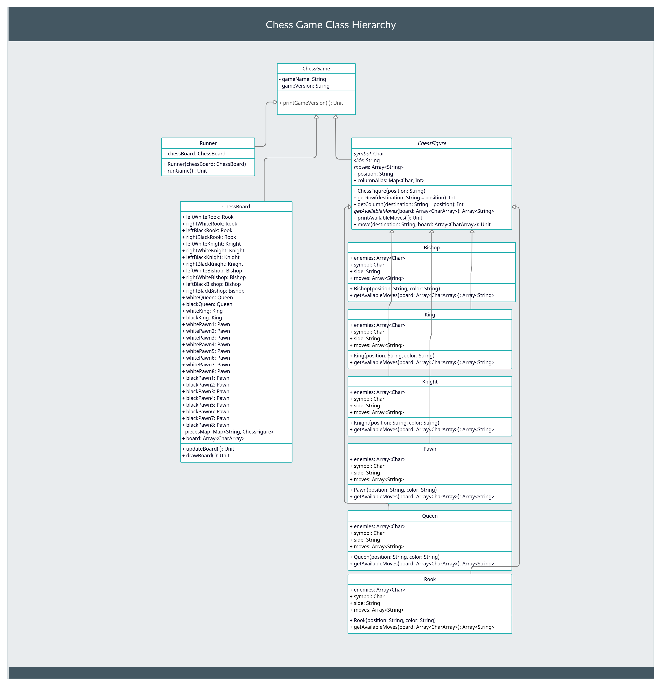

### The Game Hierarchy

### Progress
The code base become more readeble and structured. The foundation for the features and rules, which are going to be added later, was build. 

The class `ChessGame` is the parent of all clases, it is resposible for the interaction between object, at least it should be, at the moment it just shares some basic data among all classes. 

The class `ChessFigure` is the parent class for all the figure classes in this game, which encapsulates all the common logic and properties. All the clases that implements this abstract class, can be found in the "figures" folder.

The `Runner` class is resposible for simulating the begining of a game. In the absance of all the rules implemented and a early born architecture, and of course, for the debugging options, the simulation runs only for the first 8 moves. No winner or lossers are encountered yet. 